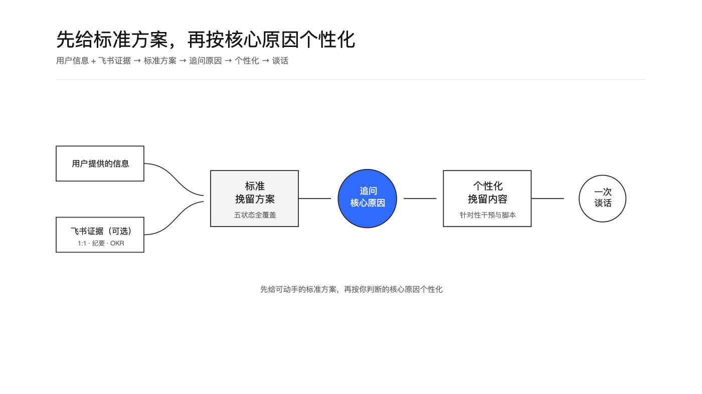
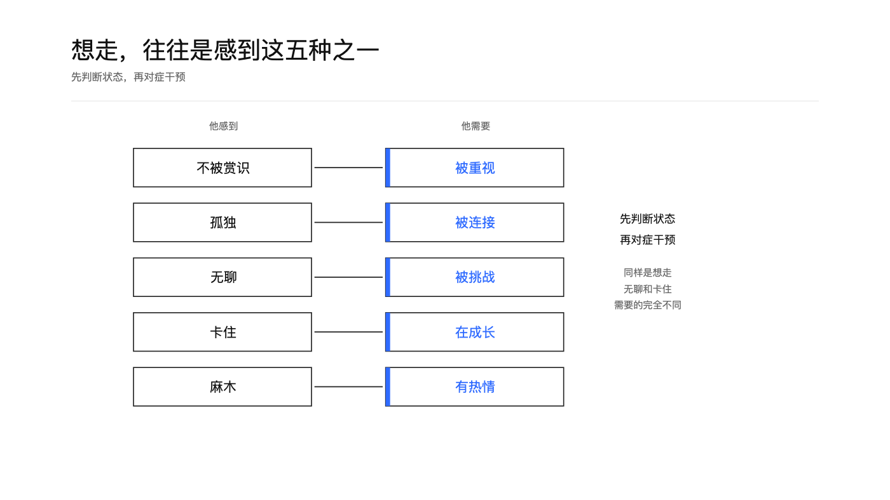
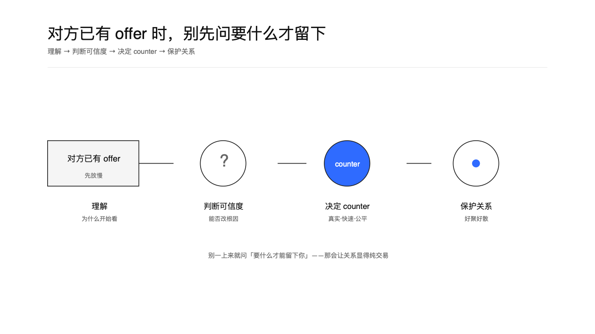
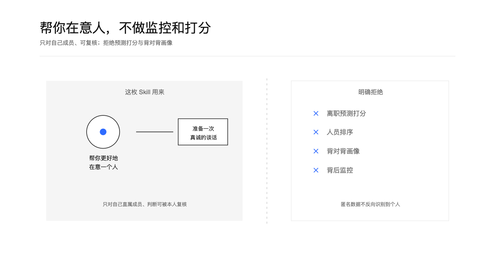

<h1 align="center">员工离职挽留</h1>

<p align="center">
  <a href="https://github.com/TongyiDai/employee-retention/actions/workflows/ci.yml"></a>
  
  
  =3.8">
  
</p>

帮团队管理者在一名核心成员「可能要走」到「已经要走」的整个区间里做判断，并准备一次真诚、具体、不功利的保留谈话。它先给一套可动手的标准挽留方案，再问你「核心原因是什么」，据此生成针对性的干预和谈话脚本。

<p align="center">
  
</p>

## 价值与适用场景

等一个人递辞呈才反应，通常已经晚了几周甚至几个月。这枚 Skill 解决三件事：**早识别**（信号还弱时看出苗头）、**看准因**（区分五种流失状态，对症下药）、**谈得对**（准备一次让人感到被在意、而不是被挽留资产的谈话）。

适合：

- 感觉某位核心成员状态不对、投入下降，但还没挑明。
- 已明确表达想走，或已拿到别家 offer，需要判断是否挽留、怎么谈。
- 要做一次加薪、晋升、股权或认可的沟通，想谈到点子上。
- 想在没有预算的情况下，做出有记忆点的认可。
- 敬业度调研暴露出某群体信号偏弱，需要落到对具体成员的一对一跟进。

明确拒绝：把它当成离职预测打分系统、对不归自己带的人做背对背画像、在员工不知情时做监控。

## 工作方式：先标准，再个性化

这枚 Skill 分两段走：

1. **先给标准挽留方案**——覆盖五种最常见的离职状态，让你立刻有可对照、可动手的东西。
2. **再问核心原因**——「你认为这位员工要走的核心原因是什么？」拿到你的判断（或飞书证据里的线索）后，生成针对性的干预、谈话脚本和核实问题。

信息来源有两种：你在对话里直接提供的情况，以及（可选、需授权）飞书上该成员的 1:1 记录、会议纪要、OKR、交流内容等真实证据。

## 五种离职状态

<p align="center">
  
</p>

一个人想走，往往是感到下面五种之一。诊断的关键是先判断状态，再对症干预——同样是"想走"，无聊和卡住需要的完全不同。详见 [references/five-states.md](references/five-states.md)。

| 他感到 | 他需要 |
| --- | --- |
| 不被赏识 | 被重视 |
| 孤独 | 被连接 |
| 无聊 | 被挑战 |
| 卡住 | 在成长 |
| 麻木 | 有热情 |

## 对方已经拿到 offer

<p align="center">
  
</p>

别一上来就问「要什么才能留下你」——那会让关系显得纯交易。按「理解 → 判断可信度 → 决定是否 counter → 保护关系」的顺序走，详见 [references/has-another-offer.md](references/has-another-offer.md)。

## 隐私与边界

<p align="center">
  
</p>

保留的前提是对方相信你**因为在意他**而行动，而不是怕失去他。这枚 Skill 帮管理者更好地在意人，硬性拒绝：离职预测打分、人员排序、背对背画像、背后监控。只对自己直属成员、且判断可被本人复核。详见 [references/boundaries.md](references/boundaries.md)。

## 快速开始

```bash
# 第一段：出标准挽留方案 + 追问核心原因
python3 scripts/diagnose.py --input tests/fixtures/case-bored.json --format markdown

# 第二段：拿到核心原因后，生成个性化方案
python3 scripts/diagnose.py --input tests/fixtures/case-bored.json --reason "觉得晋升没希望，看不到成长" --format markdown
```

飞书证据的只读读取契约见 [references/feishu-integration.md](references/feishu-integration.md)；输入格式见 [references/input-schema.md](references/input-schema.md)。

## 目录结构

```text
SKILL.md                       技能主文件（触发、两段式流程、边界）
AGENT-GUIDE.md                 跨 Agent 使用须知
references/
  five-states.json             五状态的机器可读真源
  five-states.md               五状态选型说明
  conversation-scripts.md      各状态的谈话脚本
  has-another-offer.md         对方已有 offer 的应对
  compensation-and-recognition.md  股权沟通与零预算认可
  feishu-integration.md        飞书只读证据集成
  input-schema.md              脚本输入格式
  boundaries.md                隐私与边界
scripts/
  diagnose.py                  两段式诊断器（标准方案 + 个性化）
  render_boards.py             Geometry Blue 画板渲染
tests/                         假数据与单元测试
assets/                        画板场景与渲染图
```

## 面向所有 Agent

本 Skill 不绑定任何单一平台。任何能读取 `SKILL.md`、处理用户材料、执行本地 Python 脚本的 Agent 都可使用；飞书是可选的证据来源，缺少时用用户提供的信息一样能完成。使用方式见 [AGENT-GUIDE.md](AGENT-GUIDE.md)。

## 测试

```bash
python3 tests/test_diagnose.py
```

## 许可证与出处

MIT，见 [LICENSE](LICENSE)。上游来源（`manager-dot-dev/manager-skills` 的 `retaining-developers`）、固定版本与扩展说明见 [UPSTREAM.md](UPSTREAM.md) 和 [NOTICE](NOTICE)。方法为中文语境重写与再组织，非上游文本的逐字复制。
